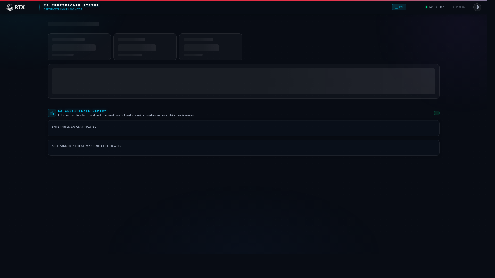

# RTX CA Certificate Status Dashboard

A standalone web dashboard built to monitor Enterprise CA certificate expirations across the Active Directory environment. It runs fully independently of MECM/SCCM, meaning it can be deployed anywhere in the Windows domain to effortlessly maintain visibility.

**Features**
- Enterprise CA Discovery: Natively executes `certutil -TCAInfo` behind the scenes to enumerate all published CAs in AD.
- Reachability Checks: Pings each CA before querying to prevent hanging processes on offline servers.
- Expiry Thresholds: Automatically color-codes certificates into a priority countdown based on how many days are left.
- Self-Signed Scans: Vigorously inspects local machine certificate stores to track fallback or isolated certs.
- Auto-Refresh: The frontend polls the local telemetry payload continuously every 60 seconds.
- Native HTTPS: The SSL enrollment is fully automated, seamlessly binding a domain-trusted enterprise certificate using HTTP.SYS.

**Quick Start**
To deploy the dashboard, open PowerShell as an Administrator and run the setup orchestrator:

`.\scripts\Setup-CACertDashboard.ps1`

By default, the structural files install natively to `C:\RTX-Dashboard-CA-Status`, binding the standalone background listener to Port 8089.

**How It Was Built**
- `Collect-CACertData.ps1` acts as the background collection engine, querying AD CAs and securely generating the flat `data/ca_data.json` payload.
- `serve.ps1` serves as an extremely lightweight background .NET web listener, completely bypassing IIS.
- `Setup-CACertDashboard.ps1` orchestrates the entire setup seamlessly and natively configures the execution parameters.

**Scheduled Tasks**
Heavy persistent lifting is offloaded entirely to two standard Windows scheduled tasks:
- `CA-Dashboard-WebServer` triggers at system startup to initialize the listener automatically.
- `CA-Dashboard-DataCollect` fires at startup and recursively every 60 minutes to actively refresh the payload data.

**Threshold Logic**
The UI states are aggressively color-coded so urgent items naturally stand out:
- Valid (Green): Over 60 days remaining.
- Warning (Amber): Less than 60 days left. This is the ideal window to begin planning renewals.
- Critical (Red): Less than 2 weeks left. These require immediate remediation to prevent outages.

**Data Drop Contract**
The collector writes a clean, flat JSON object to `data/ca_data.json` that powers the entire front-end view autonomously. It looks roughly like this:

`{ "caCertExpiry": { "collectedAt": "2026-04-14T15:00:00Z", "enterpriseSummary": { "total": 2, "valid": 1, "warning": 1, "critical": 0, "expired": 0, "unreachable": 0 }, "cas": [ { "caName": "RTX-PKI-01", "caConfig": "PKI-SRV01\\RTX-PKI-01", "status": "valid", "daysRemaining": 426 } ] } }`

**Requirements**
- Windows Server 2016+ or Windows 10+
- PowerShell 5.1+
- A domain-joined machine (to properly query the AD CA infrastructure)
